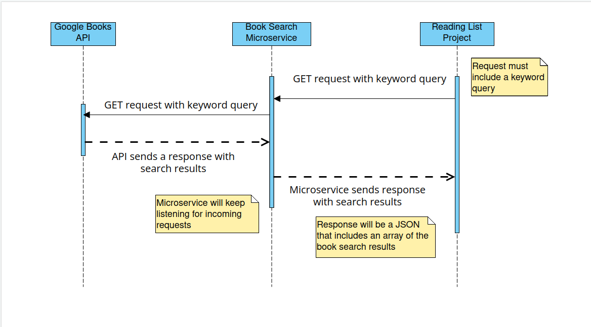

# Books Search Microservice

Books reading list microservice provides book search functionality. The user can enter a query string and the microservice will return a list of books in a JSON format based on the search query. The microservice uses Google Books API https://developers.google.com/books.

# Environment Setup

The microservice was created with NodeJS/Express v4.18.2. You need to install Node and npm on your machine. Once your have both installed, clone the repository to your machine in a local folder and within a terminal in the folder directory enter the following which will install all packages:
...
npm install
...

To run the server enter:

...
npm start
...

The server will be on localhost port 50000 (http://127.0.01:50000)

#Requesting Data
The endpoint to search for book can be called by sending a GET request to http://127.0.0.1:50000/?keyword= + "search string"

The following is an example of GET request:
...
const searchResults = await fetch('http://127.0.0.1:50000/?keyword=' + "search keyword", {
method: "GET",
});
...

#Receiving Data:
The microservice will return a JSON response which includes an array of all books.

An example of a book search for :
...
'http://127.0.0.1:50000/?keyword= + "agile" '
...

The returned results will be a JSON object which contains an array of books object:

...
[
  {
    title: 'Agile Software Development Ecosystems',
    author: [ 'James A. Highsmith', 'Jim Highsmith' ],
    description: 'Traditional software development methods struggle to keep pace with the accelerated pace and rapid change of Internet-era development. Several "agile methodologies" have been developed in response -- and these approaches to software development are showing exceptional promise. In this book, Jim Highsmith covers them all -- showing what they have in common, where they differ, and how to choose and customize the best agile approach for your needs.KEY TOPICS:Highsmith begins by introducing the values and principles shared by virtually all agile software development methods. He presents detailed case studies from organizations that have used them, as well as interviews with each method's principal authors or leading practitioners. Next, he takes a closer look at the key features and techniques associated with each major Agile approach: Extreme Programming (XP), Crystal Methods, Scrum, Dynamic Systems Development Method (DSDM), Lean Development, Adaptive Software Development (ASD), and Feature-Driven Development (FDD). In Part III, Highsmith offers practical advice on customizing the optimal agile discipline for your own organization.MARKET:For all software developers, project managers, and other IT professionals seeking more flexible, effective approaches to developing software.',
    imageLinks: {
      smallThumbnail: 'http://books.google.com/books/content?id=uE4FGFOHs2EC&printsec=frontcover&img=1&zoom=5&edge=curl&imgtk=AFLRE70TLv-sCdv2HW0Rpl_YM_F4iPR-I3Bc2rPsNrzBLI7YwkjQ1bGkddXG8aFDQB3I7GVLfjU1Qi6BPvNgAVex9EckGvpwVUX0UmRsZEL-kbEYyza3v-5WpaMD89FTJ2NUQsAHLtsj&source=gbs_api',
      thumbnail: 'http://books.google.com/books/content?id=uE4FGFOHs2EC&printsec=frontcover&img=1&zoom=1&edge=curl&imgtk=AFLRE73djSo8w1pVgaw-qQFXrhAg7dcTw9DQ6fMa69-J00eh4xKJhJbK2JbsJ6fRS4SxR5nkMfNgbU9Iho3qtA8aNE9rUiRi53nDWKVIMuX0cllnlX1EeeQu-yICCdHIMLeL_MQHbc85&source=gbs_api',
      small: 'http://books.google.com/books/content?id=uE4FGFOHs2EC&printsec=frontcover&img=1&zoom=2&edge=curl&imgtk=AFLRE7166LbSVKk6DjeK6MDFiDfII2SSZkYQK3g6LAI4DMGtwwjvt1zlNWcq07VVRtpIisJ_XdoHSY7jJM9QqFwjheaV5YF_yUclJ5fNCGCyEccpIZe_vV01eNw_XCbGJKCELps6rBpi&source=gbs_api',
      medium: 'http://books.google.com/books/content?id=uE4FGFOHs2EC&printsec=frontcover&img=1&zoom=3&edge=curl&imgtk=AFLRE73CccXr29gm_FyaJY5SGnc7m-GYsx3miWk_cDLlS8akH-nXBof5R3q4veOBJyDqj_XMcXeGe27HyL_xEmRaRdIddZhSCDIUDH-2e7e1CXFFKzlfN7WZRb78RZMQHPtchQE-XLZT&source=gbs_api',
      large: 'http://books.google.com/books/content?id=uE4FGFOHs2EC&printsec=frontcover&img=1&zoom=4&edge=curl&imgtk=AFLRE72hU2Gs-u66EISibf_s9BQCPS5qwo1xzWH8qoedtOs4DFVDjs1bx-Y72FZ15u_xt5G6OvUxqp_12au6RRJv_fPR-jDHaElzbxf75ZoiTDkt0IhZ1HFh35QhPYra8vEo_YcZV9zJ&source=gbs_api',
      extraLarge: 'http://books.google.com/books/content?id=uE4FGFOHs2EC&printsec=frontcover&img=1&zoom=6&edge=curl&imgtk=AFLRE73-UP3D_K5hSzYBZFalpTTr4CdQzwYRlt7pmlbu7N6QT7H9gFkyfOIguCXNb1-QsUpRur5YLhU0oZJNtvlisFznFAVnaB_bh_4F-UGRrmhiDYi3f6XIAZRafKDocMbJaOqeUyFR&source=gbs_api'
    },
    industryIdentifiers: [ [Object], [Object] ],
    infoLink: 'http://books.google.com/books?id=uE4FGFOHs2EC&dq=agile&hl=&source=gbs_api',
    language: 'en',
    publishedDate: '2002',
    publisher: 'Addison-Wesley Professional',
    categories: [ 'Agile software development' ],
    snippet: {
      textSnippet: 'In this book, Jim Highsmith covers them all -- showing what they have in common, where they differ, and how to choose and customize the best agile approach for your needs.KEY TOPICS:Highsmith begins by introducing the values and principles ...'
    }
  },
  {
    title: 'Introduction to Agile Methods',
    author: [ 'Sondra Ashmore Ph.D.', 'Kristin Runyan' ],
    description: 'A Thorough Introduction to the Agile Framework and Methodologies That Are Used Worldwide Organizations of all shapes and sizes are embracing Agile methodologies as a way to transform their products, customer satisfaction, and employee engagement. Many people with varying levels of work experience are interested in understanding the architecture and nuances of Agile, but it is difficult to know where to start. Numerous practitioner books are available, but there has never been a single source for unbiased information about Agile methodologies–until now. Introduction to Agile Methods is the place to start for students and professionals who want to understand Agile and become conversant with Agile values, principles, framework, and processes. Authors Sondra Ashmore and Kristin Runyan use academic research and their own experiences with numerous Agile implementations to present a clear description of the essential concepts. They address all key roles and the entire development life cycle, including common roadblocks that must be overcome to be successful. Through the authors’ realistic use cases, practical examples, and thought-provoking interviews with pioneering practitioners, complex concepts are made relatable. No matter what your role or level of experience, this book provides a foundational understanding that can be used to start or enhance any Agile effort. Coverage includes How Agile compares with the Waterfall method and when to use each Why Agile demands a cultural transformation–and how that looks to each participant Comparing various Agile methodologies, including Scrum, Kanban, Extreme Programming (XP), Crystal, Feature Driven Development (FDD), Lean, and DSDM Understanding the roles within Agile and how they work together to create superior results Agile approaches to requirements gathering, planning, estimating, tracking, reporting, testing, quality, and integration Extending Agile beyond IT',
    imageLinks: {
      smallThumbnail: 'http://books.google.com/books/publisher/content?id=hE7iAwAAQBAJ&printsec=frontcover&img=1&zoom=5&edge=curl&imgtk=AFLRE72tLcxeNx6rJDUA7WlStxYO1-ANkPAnN28fobZAEqs8AoFUNCRwAbrSevjqxpBykCFBn0Yuo8X8Fv89hfc_ZKrz5fsmkiFEpjtbJfUMT0NZUT5iqig-ygeqXmUjQvGg1Ti8jPBW&source=gbs_api',
      thumbnail: 'http://books.google.com/books/publisher/content?id=hE7iAwAAQBAJ&printsec=frontcover&img=1&zoom=1&edge=curl&imgtk=AFLRE73nh7VsPVqZjE5bK1MvrjALsLOnOlk4G3AMWcdnydXslIO6OF3TW1s5UVxxCpGNVWSYeqsTsu2KmqEsY1_CD7Kys5GYaCBY7QN6cF8fHX4ZSrfyLNymahymvdYbLjq8eLWkIWZW&source=gbs_api',
      small: 'http://books.google.com/books/publisher/content?id=hE7iAwAAQBAJ&printsec=frontcover&img=1&zoom=2&edge=curl&imgtk=AFLRE72u0nSZcXVD0tnKVpiKKKJD_8ABtXKpU0-rwNOsYcBRhQWd94We2e7jIxvwWx7YTmShddBrGX0iqSHIb0Jjij91iOWW_cKuVq2K8fzcgK0pleWLiU-UUm1LkoYM6hVbRNGyadIs&source=gbs_api',
      medium: 'http://books.google.com/books/publisher/content?id=hE7iAwAAQBAJ&printsec=frontcover&img=1&zoom=3&edge=curl&imgtk=AFLRE71t-dOoFcsPF5RvdsfK4J78bRlxNyQnQ0ZOKAQjcqbNz_kqYWZsVLS8QXjWXkC-EMIhl45U_gD5jjnsWnou4R8HBt3YyXXMkOEeAT66E6b3Sau4VDjv4LQhyq_kiwEztMsKWSCB&source=gbs_api',
      large: 'http://books.google.com/books/publisher/content?id=hE7iAwAAQBAJ&printsec=frontcover&img=1&zoom=4&edge=curl&imgtk=AFLRE71BUxP6O1BGhbxWUn9cbSvc3p2P1pjC6N_onNyQfRE4hQxAjExpfgMBj8ilwALeY56rvfhbpyqpOFF5mYV3WourLXaI_OyTWLrrhZAKfNZEwF1JRiQtiQKMm-7_cnnF-NFIZwdQ&source=gbs_api',
      extraLarge: 'http://books.google.com/books/publisher/content?id=hE7iAwAAQBAJ&printsec=frontcover&img=1&zoom=6&edge=curl&imgtk=AFLRE70PMnJAJlHGrYaYm3o-gqU2jeLBqm76vdTm8P9pDb_NU6OEthY518frWliOU3TPVqFNy1ZsyGdx_HCkGy8ed54udPD1orYmsFEs6fuT8DjQyUMovvDwmtx4iIbeyZaBJ-t6IwDb&source=gbs_api'
    },
    industryIdentifiers: [ [Object], [Object] ],
    infoLink: 'https://play.google.com/store/books/details?id=hE7iAwAAQBAJ&source=gbs_api',
    language: 'en',
    publishedDate: '2014-06-23',
    publisher: 'Addison-Wesley Professional',
    categories: [ 'Computers' ],
    snippet: {
      textSnippet: 'No matter what your role or level of experience, this book provides a foundational understanding that can be used to start or enhance any Agile effort.'
    }
  },.......
]
...
#UML Sequence Diagram

